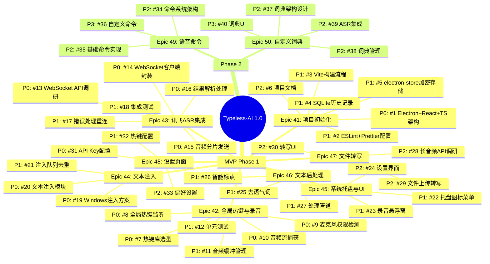

# Typeless-AI 项目思维导图

> 完整项目结构与开发路线图

---

## 🗺️ Mermaid 思维导图（GitHub 可渲染）



---

## 📊 优先级分布

```
🔴 P0 (Critical) - 17个
  ├─ 核心架构 (1个)
  ├─ 热键录音 (4个)
  ├─ ASR集成 (4个)
  ├─ 文本注入 (2个)
  └─ API配置 (1个)

🟡 P1 (High) - 17个
  ├─ 工程化 (5个)
  ├─ 测试 (2个)
  ├─ 错误处理 (1个)
  ├─ UI基础 (2个)
  ├─ 后处理 (3个)
  ├─ 队列管理 (1个)
  └─ 热键配置 (1个)

🟢 P2 (Medium) - 7个
  ├─ 文件转写 (3个)
  ├─ 完整UI (1个)
  └─ 偏好设置 (1个)
```

---

## 🎯 开发路线图

### Week 1-2: 核心功能（P0）
```
#1 项目初始化
  ↓
#7-#10 全局热键 + 录音
  ↓
#13-#16 ASR 集成
  ↓
#19-#20 文本注入
  ↓
#31 API Key 配置
```
**里程碑**: 实现"语音 → 文字 → 输入"完整流程

### Week 3: 工程化（P1）
```
#2-#6 代码规范 + 构建 + 存储
  ↓
#11-#12 缓冲管理 + 测试
  ↓
#17-#18 错误处理 + 集成测试
```
**里程碑**: 代码质量达标，测试覆盖 ≥ 90%

### Week 4: UI 与体验（P1）
```
#22-#23 托盘 + 悬浮窗
  ↓
#25-#27 后处理
  ↓
#21 注入队列
```
**里程碑**: 用户体验完整，文本可读性提升

### Week 5+: 增强功能（P2）
```
#24 完整设置界面
  ↓
#28-#30 文件转写
  ↓
#32-#33 偏好设置
```
**里程碑**: 功能完整，可发布 MVP 1.0

---

## 🔗 依赖关系图

```
Epic 41 (项目初始化)
  ├── 所有 Epic 的基础
  └── 必须最先完成 ✓

Epic 42 (热键录音) ──┐
                      ├── 并行开发 ✓
Epic 43 (ASR集成) ────┘
                      │
Epic 44 (文本注入) ───┘
  └── 依赖 Epic 42 和 43

Epic 45 (UI) ──┐
               ├── 并行开发 ✓
Epic 46 (后处理) │
Epic 48 (设置) ─┘
  └── 依赖 Epic 41

Epic 47 (文件转写)
  └── 可独立开发，最后集成
```

---

## 📈 工时统计

| Epic | Issues | 工时 | 优先级分布 |
|------|--------|------|-----------|
| #41 项目初始化 | 6 | ~24h | P0:1, P1:4, P2:1 |
| #42 热键录音 | 6 | ~27h | P0:4, P1:2 |
| #43 ASR集成 | 6 | ~26h | P0:4, P1:2 |
| #44 文本注入 | 3 | ~13h | P0:2, P1:1 |
| #45 托盘UI | 3 | ~16h | P1:2, P2:1 |
| #46 后处理 | 3 | ~14h | P1:3 |
| #47 文件转写 | 3 | ~15h | P2:3 |
| #48 设置页面 | 3 | ~11h | P0:1, P1:1, P2:1 |
| **MVP 总计** | **33** | **~146h** | P0:17, P1:17, P2:7 |
| #49 语音命令 | 3 | ~14h | P2:2, P3:1 |
| #50 自定义词典 | 4 | ~17h | P2:3, P3:1 |
| **项目总计** | **40** | **~177h** | - |

---

## 🎯 成功指标

### MVP 1.0 (Phase 1)
- ✅ 打字替代率 ≥ 80%
- ✅ 中文识别准确率 ≥ 95%
- ✅ 端到端延迟 ≤ 2 秒
- ✅ 用户每周活跃 ≥ 4 天

### Phase 2
- ✅ 语音命令准确率 ≥ 95%
- ✅ 词典提升识别准确率 ≥ 10%

---

## 🔗 相关链接

- **Project 看板**: https://github.com/users/1509356426/projects/2
- **Issues 列表**: https://github.com/1509356426/Typeless-AI/issues
- **PRD 文档**: [typeless-ai-prd.md](./typeless-ai-prd.md)
- **GitHub 仓库**: https://github.com/1509356426/Typeless-AI
